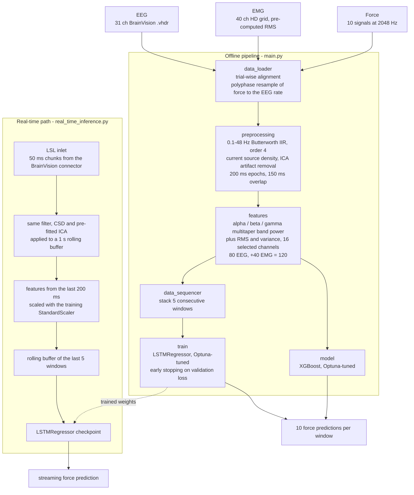

# EEG + EMG → Finger Force Prediction

Regressing continuous per-finger force from non-invasive brain and muscle signals, with an
offline training pipeline and a real-time streaming inference path.


Research internship project, 2025.

## The problem

Non-invasive motor decoding usually stops at classification — *which* movement, out of a fixed
set. This project targets the harder regression version: given a sliding window of cortical
activity, predict the **continuous force each finger is producing**, on all ten force signals
(flexion and abduction for five digits) at once.

The recording session provides three simultaneous streams from a grasping task:

| Stream | Channels | Notes |
|---|---|---|
| EEG | 31 | BrainVision, one `.vhdr` file per trial |
| EMG | 40 | high-density grid, supplied as pre-computed RMS |
| Force | 10 | 5 digits × flexion/abduction, recorded at 2048 Hz |

Every model is trained twice — **EEG-only** and **EEG+EMG fusion** — because the central
question is how much of the force signal is recoverable from cortex alone, and how much the
muscular channel adds on top. Two model families are compared under both conditions: a
gradient-boosting baseline and a recurrent network that sees a short history of windows.

## Pipeline



**Alignment.** The three streams arrive in different formats and rates: EEG as one BrainVision
file per trial, EMG and force as pickled DataFrames covering a whole recording. `data_loader`
matches recordings to their EEG files by name, slices the DataFrames into equal per-trial
blocks, resamples force from 2048 Hz to the EEG rate (polyphase), and truncates all three to a
common length.

**Preprocessing.** Standard 10-20 montage, 0.1–48 Hz 4th-order Butterworth IIR bandpass,
current source density transform (a Laplacian re-reference that sharpens spatial resolution),
then 15-component ICA with EOG components identified from Fp1/Fp2 and removed. Data is cut
into 200 ms epochs with 150 ms overlap, so a new feature vector is produced every 50 ms.

**Features.** Per epoch and per channel: alpha (8–12 Hz), beta (13–30 Hz) and gamma (30–48 Hz)
band power from a multitaper PSD, plus RMS and variance. Restricted to the 16 channels chosen
by the studies in `analysis/`, that is 80 EEG features; the fusion configuration appends the
40 per-channel EMG values for 120. Targets are the mean force over the epoch, per signal.

**Models.** XGBoost consumes single feature vectors; the LSTM consumes sequences of 5
consecutive windows (a 400 ms look-back) and predicts from the final time step through one
linear layer to 10 outputs. Both are tuned with Optuna — hidden size, layer count, learning
rate and dropout for the LSTM; depth, regularisation, subsampling and learning rate for
XGBoost. `src/model.py` also keeps the earlier `RandomizedSearchCV` and `GridSearchCV` XGBoost
variants that the Optuna version superseded.

### Channel selection

The 16-channel subset in `features.get_best_channels()` is not arbitrary. `analysis/` contains
the two studies that produced it: `01_find_best_channels.py` scores every channel by the
R² between its beta power and average force and renders the result as a scalp topomap;
`02_find_channels_with_lasso.py` fits a Lasso over all channels and reports the non-zero
coefficients. `00_preprocess_and_save.py` caches the preprocessed data so the Lasso study can
be re-run without repeating the expensive stages.

## Repository layout

```
├── main.py                      experiment driver (argparse CLI)
├── real_time_inference.py       LSL streaming inference
├── test_inference_speed.py      LSTM forward-pass latency benchmark
├── requirements.txt             direct dependencies for pip
├── pyproject.toml / uv.lock     canonical, locked environment
├── src/
│   ├── data_loader.py           load and align EEG / EMG / force per trial
│   ├── preprocessing.py         filter, CSD, ICA, epoch  (EEG-only and +EMG variants)
│   ├── features.py              band power + time-domain features, channel list
│   ├── data_sequencer.py        windows → LSTM sequences
│   ├── model.py                 XGBoost trainers + LSTMRegressor definition
│   ├── train.py                 LSTM training loops (plain and Optuna + early stopping)
│   ├── visualize.py             result and diagnostic plots
│   └── visualize_features.py    standalone feature sanity-check plots
├── analysis/                    channel-selection studies (see above)
├── data/                        empty by design — see Data availability
└── experiments/                 figures and logs kept from each configuration run
```

`experiments/` is the lab notebook: LSTM fusion runs (35-epoch, earlier early-stopping,
bidirectional, sequence-length sweep, Optuna post-processing at two smoothing settings) and
the four XGBoost tuning strategies, each with its prediction overlays and Optuna logs.

## Running it

Dependencies are managed with [uv](https://github.com/astral-sh/uv):

```bash
uv sync                  # or: pip install -r requirements.txt
```

`main.py` selects one of the four configurations from the command line:

```bash
uv run main.py                                  # EEG+EMG fusion, LSTM  (defaults)
uv run main.py --features eeg                   # EEG-only, LSTM
uv run main.py --model xgboost                  # EEG+EMG fusion, XGBoost
uv run main.py --features eeg --model xgboost   # EEG-only, XGBoost
uv run main.py --help
```

Each stage caches its output to a configuration-specific `.pkl` in the repository root
(preprocessed epochs → features → sequences), so a re-run skips straight to training. Delete
the relevant cache to force a recompute. The trained model is written to
`trained_<model>_optuna_<features>_model.{pth,pkl}` and the run finishes by plotting loss
curves, per-signal prediction overlays and the Optuna history.

Channel-selection studies are run directly and produce topomaps:

```bash
uv run analysis/00_preprocess_and_save.py    # once — caches preprocessed epochs
uv run analysis/01_find_best_channels.py
uv run analysis/02_find_channels_with_lasso.py
```

### Real-time inference

`real_time_inference.py` opens a Lab Streaming Layer inlet on the BrainVision connector's EEG
stream, pulls 50 ms chunks into a 1-second rolling buffer, applies the same filter → CSD →
ICA chain, extracts features from the trailing 200 ms window, scales them with the
`StandardScaler` fitted during training, and feeds a rolling buffer of the last 5 windows to
the trained LSTM — printing a fresh 10-signal force estimate per chunk.

`test_inference_speed.py` isolates the model forward pass and times it over 1000 runs on CPU
or CUDA, to check the network is not itself the bottleneck in that loop.

## Data availability

**Raw recordings are not included.** They are human-subject EEG/EMG from a pilot session and
are not mine to redistribute, so `data/` is empty by design (a tracked `.gitkeep` holds the
directory).

Cached intermediates and trained weights are excluded too — roughly 3 GB of `.pkl` and `.pth`
files, well past GitHub's file size limits, and fully reproducible by running the pipeline.

To run against your own recordings, reproduce the layout that `src/data_loader.py` expects:

```
data/pilot_20250807/
├── eeg/                                           one BrainVision .vhdr per trial
├── Kinetics_EEG_AUXData_dataframe.pkl             force, 2048 Hz, columns starting "D"
└── KineticsRecord_Subj2_RMS_dataframe.pkl         EMG RMS, columns starting "GR"
```

Both DataFrames need a `recording` column whose values match the EEG filename prefixes; trials
are recovered by splitting each recording's rows evenly across its EEG files.

## Known issues

Carried over from the internship and left documented rather than silently patched:

- **The real-time path depends on a local artifact the repository cannot rebuild.**
  `real_time_inference.py` loads the montage and the pre-fitted ICA from
  `real_time_preprocessing_tools.pkl`, which is gitignored and therefore absent from a fresh
  clone, and nothing here regenerates it — the script exits with an explanatory message
  instead. (The load itself was missing altogether until this cleanup, leaving `montage` and
  `ica` undefined and the streaming loop failing with `NameError` on the first chunk.)
- **Real-time hyperparameters are hardcoded.** `real_time_inference.py` and
  `test_inference_speed.py` both reconstruct `LSTMRegressor` from architecture values typed in
  by hand after one specific Optuna run. Nothing checks them against the checkpoint, so they
  silently go stale if the model is retrained — the architecture should be saved alongside the
  weights and loaded with them.
- **`test_inference_speed.py` has an absolute path** to the checkpoint from the machine it was
  written on, so it exits immediately anywhere else. It needs to resolve the path relative to
  the repository root.
- **The XGBoost branch of `main.py` unpacks four values** from
  `train_and_evaluate_xgboost_Optuna`, which returns three — it has no training-history object,
  unlike the LSTM trainer. `--model xgboost` raises `ValueError` at that line until the return
  signatures are reconciled.
- **No test suite.** Correctness so far rests on the diagnostic plots in `experiments/`.
